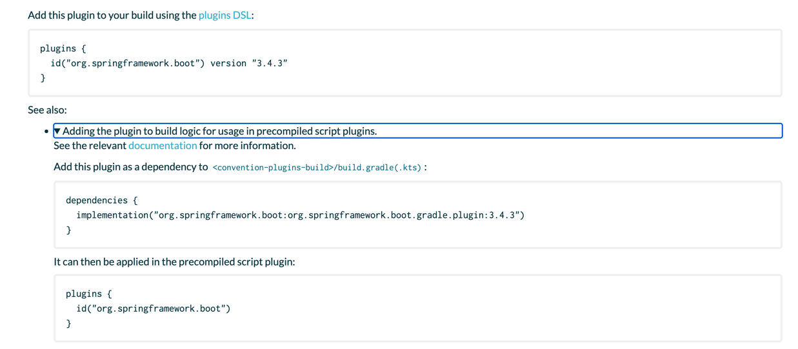

# Convention plugins

- A document on how to create convention plugins.

## What They Are and Why Precompiled Plugins Are a Good Choice

- A convention plugin is a plugin that defines conventions for a project.
    - It is useful for setting Java versions, Kotlin configurations, or establishing project-wide standards (convention
      applied across the project).
- Convention plugins are mostly implemented using precompiled plugins.
    - This [table](https://docs.gradle.org/current/userguide/custom_plugins.html#custom_plugins_2) provides a good
      comparison of the benefits of different plugin types.
- [The official Kotlin documentation]((https://kotlinlang.org/docs/gradle-best-practices.html#use-kotlin-dsl))
  recommends using Kotlin DSL, and precompiled plugins can be implemented using Kotlin
  DSL.

> A convention plugin is a plugin that normally configures existing core and community plugins with your own
> conventions (i.e. default values) such as setting the Java version by using java.toolchain.languageVersion =
> JavaLanguageVersion.of(17). Convention plugins are also used to enforce project standards and help streamline the
> build process. They can apply and configure plugins, create new tasks and extensions, set dependencies, and much more.
>
> [source](https://docs.gradle.org/current/userguide/implementing_gradle_plugins_precompiled.html)

> A convention plugin is typically a precompiled script plugin that configures existing core and community plugins with
> your own conventions (i.e. default values) such as setting the Java version by using java.toolchain.languageVersion =
> JavaLanguageVersion.of(17). Convention plugins are also used to enforce project standards and help streamline the
> build process. They can apply and configure plugins, create new tasks and extensions, set dependencies, and much more.
>
> [source](https://docs.gradle.org/current/userguide/custom_plugins.html#sec:convention_plugins)

## Using `buildSrc` to Share Common Build Logic

- The Gradle documentation recommends placing convention plugins inside `buildSrc`.

- Follow these steps:
    1. Create a convention plugin inside the `buildSrc` directory using Kotlin DSL.
    2. Write a build script inside the `buildSrc` folder to compile the convention plugin (ensuring it uses Kotlin DSL).
    3. Apply the convention plugin in the build scripts of other modules using the `plugins {}` block.

> We can write a plugin that encapsulates the build logic common to several subprojects in a project.
> This kind of plugin is called a convention plugin.
> While writing plugins is outside the scope of this section, the recommended way to build a Gradle project is to put
> common build logic in a convention plugin located in the buildSrc.
>
> [source](https://docs.gradle.org/current/userguide/sharing_build_logic_between_subprojects.html#sec:sharing_logic_via_convention_plugins)

> To develop a convention plugin, we recommend using buildSrc – which represents a completely separate Gradle build.
> buildSrc has its own settings file to define where dependencies of this build are located.
>
> [source](https://docs.gradle.org/current/userguide/custom_plugins.html#sec:convention_plugins)

### Write build script in buildSrc

```kotlin
// buildSrc/build.gradle.kts

// 1. Add kotlin-dsl plugin
plugins {
    `kotlin-dsl`
}

// 2. Specifying the Repository
repositories {
    mavenCentral()
}

// 3. Add Kotlin Gradle Plugin
dependencies {
    implementation("org.jetbrains.kotlin:kotlin-gradle-plugin:1.9.23")
}
```

#### 1. Add kotlin-dsl plugin

- This plugin allows discovering convention plugins written as precompiled script plugins.

> In order for precompiled script plugins to be discovered, the buildSrc project needs to apply the kotlin-dsl plugin in its build.gradle.kts file.  
> [primary-source](https://docs.gradle.org/current/samples/sample_convention_plugins.html#compiling_convention_plugins)

- [Gradle Kotlin DSL Plugin](https://plugins.gradle.org/plugin/org.gradle.kotlin.kotlin-dsl)
- [source code](https://github.com/gradle/gradle/tree/HEAD/platforms/core-configuration/kotlin-dsl-plugins)
- You can check classes such as `KotlinDslCompilerPlugins` in the source code.

#### 2. Specifying the Repository

- Specifies the repository from which Gradle will download the necessary dependencies.

#### 3. Add Kotlin Gradle Plugin

- Downloads the [Kotlin Gradle Plugin library](https://mvnrepository.com/artifact/org.jetbrains.kotlin/kotlin-gradle-plugin) and adds it to classpath of buildSrc.
- When using plugin identifiers such as `kotlin("jvm")` in precompiled script plugins or other Kotlin DSL code within buildSrc, they reference the plugin implementation included in this dependency.
    - While plugins published to Gradle’s Plugin Portal can be applied directly in a normal build script using the plugins block,
      buildSrc is a separate project that compiles your custom convention plugins.
    - Therefore, you must explicitly add the Kotlin Gradle Plugin as a dependency so that its classes are available at compile time for your buildSrc code.
- Therefore, the plugin version must be specified in the build script(`buildSrc/build.gradle.kts`).
- In a convention plugin, the `plugins {}` block cannot declare a version but instead references the added plugin implementation in build script(`buildSrc/build.gradle.kts`).
- Refer to the example in the link below.
- [applying-external-plugins](https://docs.gradle.org/current/userguide/implementing_gradle_plugins_precompiled.html#sec:applying_external_plugins)

### Tip: Adding the plugin to build logic for usage in precompiled script plugins

```kotlin
// buildSrc/src/main/kotlin/spring-boot-convention.gradle.kts

plugins {
    id("org.springframework.boot")
}
```

- When applying a plugin in a convention plugin, the plugin name is specified in the `plugins {}` block. However, when explicitly adding a plugin dependency to the build script, the "Maven Coordinates" must be specified in the `dependencies {}` block.
- For plugin published to Gradle's Plugin Portal, the "Maven Coordinates" can be found directly in the documentation.
- For example, in the documentation for [org.springframework.boot](https://plugins.gradle.org/plugin/org.springframework.boot), you can find it by expanding `<details>` tag element.



```kotlin
// buildSrc/build.gradle.kts

dependencies {
    implementation("org.springframework.boot:org.springframework.boot.gradle.plugin:3.4.3")
}
```

### Write convention plugin

```kotlin
// buildSrc/src/main/kotlin/kotlin-convention.gradle.kts
// (Precompiled Script Plugin)

// 1. Apply kotlin-jvm module
plugins {
    kotlin("jvm")
}

// 2. Specify group & version
group = "com.g2s"
version = "unspecified"

// 3. Specifying the Repository
repositories {
    mavenCentral()
}

// 4. Add Dependencies
dependencies {
    testImplementation(kotlin("test"))
}

// 5. Applying the JUnit Platform
tasks.test {
    useJUnitPlatform()
}

// 6. Setting JDK 17
kotlin {
    jvmToolchain(17)
}
```

#### 1. Apply kotlin-jvm module

- References the JVM module from the Kotlin Gradle Plugin added in the build script(`buildSrc/build.gradle.kts`).

#### 2. Specify group & version

- Specifies the group ID and version of the plugin.
- Ensures that Gradle can clearly identify the plugin or library.
- Typically, when creating a Gradle project plugin, a specific group and version must be set to allow other projects to reference it easily.
    - `unspecified` means that the version has not been explicitly defined.

#### 3. Specifying the repository

- Specifies the repository (Maven Central) from which Kotlin and other dependencies will be downloaded.
- Apart from the `kotlin("jvm")` plugin, any additional libraries required by the project must be explicitly downloaded.
- This is configured to fetch the Kotlin standard library and other plugins from Maven Central.

#### 4. Add Dependencies

- `kotlin("test")` is a test utility set that includes JUnit and other Kotlin test libraries.
- It references the `org.jetbrains.kotlin:kotlin-test` module from the added Kotlin Gradle Plugin in the build script(`buildSrc/build.gradle.kts`).

#### 5. Applying the JUnit Platform

- By default, Gradle runs JUnit 4, but this setting is required to use JUnit 5 (JUnit Jupiter).

#### 6. Setting JDK 17

- Configures the Kotlin compiler to use JDK 17.

```kotlin
// app1/build.gradle.kts
plugins {
   id("kotlin-convention")
}

```

- The convention plugin, which defines common Kotlin build logic, can be applied to subprojects.

## Managing Dependency Versions Using a Version Catalog

- Instead of specifying the version of external libraries such as the Kotlin Gradle Plugin directly in build script(`buildSrc/build.gradle.kts`), version catalogs can be used to manage versions.
- For details on using version catalogs, refer to this [document](version-catalog.md).

### 1. Create a Version Catalog

```toml
# gradle/libs.versions.toml
[versions]
kotlin = "1.9.23"

[libraries]
kotlin-gradle-plugin = { module = "org.jetbrains.kotlin:kotlin-gradle-plugin", version.ref = "kotlin" }
```

### 2. Create a Settings File

- Since buildSrc is treated as a separate build from the main root project, it cannot directly access `../gradle/libs.versions.toml`.
    - However, subprojects’ build scripts can access it by default.
    - [reference](https://discuss.gradle.org/t/using-version-catalog-from-buildsrc-buildlogic-xyz-common-conventions-scripts/48534)
- Therefore, the settings file must explicitly declare which version catalog file to import.
- [importing-catalog-from-file](https://docs.gradle.org/current/userguide/version_catalogs.html#sec:importing-catalog-from-file)

```kotlin
// buildSrc/settings.gradle.kts

dependencyResolutionManagement {
    versionCatalogs {
        create("libs") {
            from(files("../gradle/libs.versions.toml"))
        }
    }
}
```

### 3. Modify the Build Script

```kotlin
// buildSrc/build.gradle.kts

plugins {
    `kotlin-dsl`
}

repositories {
    mavenCentral()
}

dependencies {
    implementation(libs.kotlin.gradle.plugin)
}
```

- Now, libraries can be referenced using the version catalog alias syntax.
- [reference](https://docs.gradle.org/current/userguide/version_catalogs.html#sec:accessing-catalog)
