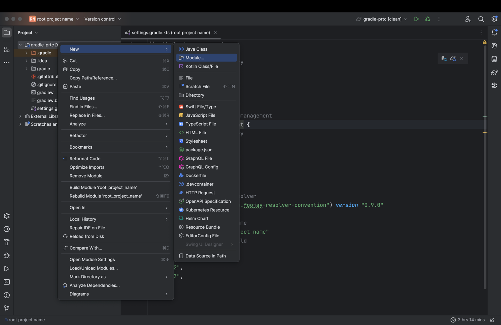
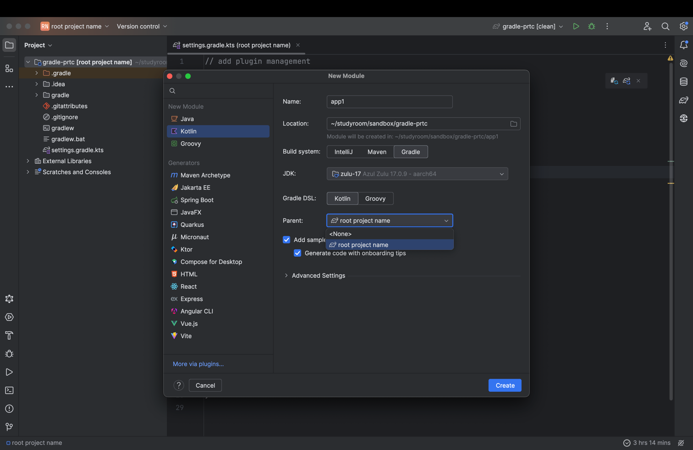

# How To Configure Kotlin Multi-Project

## 1. Initialize Kotlin Project

- You can set up an initial configuration for kotlin application by 'gradle init'
- The initial configuration set up, and the script is modified to fit a multi-project.
- [primary-source](https://docs.gradle.org/current/samples/sample_building_kotlin_applications.html)

### Installation

- If gradle is not installed, you must install it.
- [primary-source](https://docs.gradle.org/current/userguide/installation.html)

### Default Build Name

- If `rootProject.name` is not explicitly specified, Gradle’s default behavior is to use the name of the root directory
  as the build’s name.

> rootProject.name assigns a name to the build, which overrides the default behavior of naming the build after the
> directory it’s in. It’s recommended to set a fixed name as the folder might change if the project is shared - e.g. as
> root of a Git repository.
>
> [source](https://docs.gradle.org/current/samples/sample_building_java_applications.html#review_the_project_files)

### result

- After initialization, the project structure is as follows.

```text
.
├── app
│   ├── build.gradle.kts
│   └── src
│       ├── main
│       │   ├── kotlin
│       │   │   └── org
│       │   │       └── example
│       │   │           └── App.kt
│       │   └── resources
│       └── test
│           ├── kotlin
│           │   └── org
│           │       └── example
│           │           └── AppTest.kt
│           └── resources
├── gradle
│   ├── libs.versions.toml
│   └── wrapper
│       ├── gradle-wrapper.jar
│       └── gradle-wrapper.properties
├── gradlew
├── gradlew.bat
└── settings.gradle.kts
```

## 2. Writing Setting Files

```kotlin
// add plugin management
pluginManagement {
    // 1) configure repository
    repositories {
        gradlePluginPortal()
        mavenCentral()
    }
}
// add dependency resolution management
dependencyResolutionManagement {
    // 1) configure repository
    repositories {
        mavenCentral()
    }
}
// apply setting plugins
plugins {
    // 1) apply toolchain resolver
    id("org.gradle.toolchains.foojay-resolver-convention") version "0.9.0"
}
// define the root project name
rootProject.name = "root project name"
// add subprojects to the build
include(
    "web",
    "domain",
    "infra",
)
```

- Add Plugin Management
    - Configure repository
- Add Dependency Resolution Management
    - Configure Repository
- Apply Setting Plugins
    - Apply Toolchain Resolver

## 3. Modify project structure



- Use IntelliJ’s module creation feature.



- Delete the default generated module (app).
- Remove the build script of the root project.
- Set the parent project as the root project.

```text
.
├── web
│   ├── build.gradle.kts
│   └── src
│       ├── main
│       │   ├── kotlin
│       │   │   └── Main.kt
│       │   └── resources
│       └── test
│           ├── kotlin
│           └── resources
├── domain
│   ├── build.gradle.kts
│   └── src
│       ├── main
│       │   ├── kotlin
│       │   │   └── Main.kt
│       │   └── resources
│       └── test
│           ├── kotlin
│           └── resources
├── infra
│   ├── build.gradle.kts
│   └── src
│       ├── main
│       │   ├── kotlin
│       │   └── resources
│       └── test
│           ├── kotlin
│           └── resources
├── gradle
│   ├── libs.versions.toml
│   └── wrapper
│       ├── gradle-wrapper.jar
│       └── gradle-wrapper.properties
├── gradlew
├── gradlew.bat
└── settings.gradle.kts

```

## 4. Apply common settings(conventions) to the entire project.

### Applying convention plugins from the `buildSrc` directory

- Gradle recommends this approach.
- However, [other approach](https://docs.gradle.org/current/userguide/plugins.html#sec:subprojects_plugins_dsl) is not recommended.

- The following section explains step-by-step how to create and apply a convention plugin.
- For more details, refer to [this document](../convention-plugin/convention-plugin.md).

#### 1. Write the Version Catalog

```toml
# gradle/libs.versions.toml
[versions]
kotlin = "1.9.23"

[libraries]
kotlin-gradle-plugin = { module = "org.jetbrains.kotlin:kotlin-gradle-plugin", version.ref = "kotlin" }
```

#### 2. Set Up the buildSrc Directory

```kotlin
// buildSrc/settings.gradle.kts
dependencyResolutionManagement {
    versionCatalogs {
        create("libs") {
            from(files("../gradle/libs.versions.toml"))
        }
    }
}

```

```kotlin
// buildSrc/build.gradle.kts
plugins {
    `kotlin-dsl`
}

repositories {
    mavenCentral()
}

dependencies {
    implementation(libs.kotlin.gradle.plugin)
}

```

#### 3. Write the Convention Plugin

```kotlin
//  buildSrc/src/main/kotlin/kotlin-convention.gradle.kts 
plugins {
    kotlin("jvm")
}

group = "com.g2s"
version = "unspecified"

repositories {
    mavenCentral()
}

dependencies {
    testImplementation(kotlin("test"))
}

tasks.test {
    useJUnitPlatform()
}

kotlin {
    jvmToolchain(17)
}
```

### Apply the Convention Plugin in Submodules

```kotlin
// domain/build.gradle.kts
plugins {
    id("kotlin-convention")
}
```

## Snippet

- https://github.com/satanmoo/Snippet/tree/main/kotlin/kotlin-multi-project
